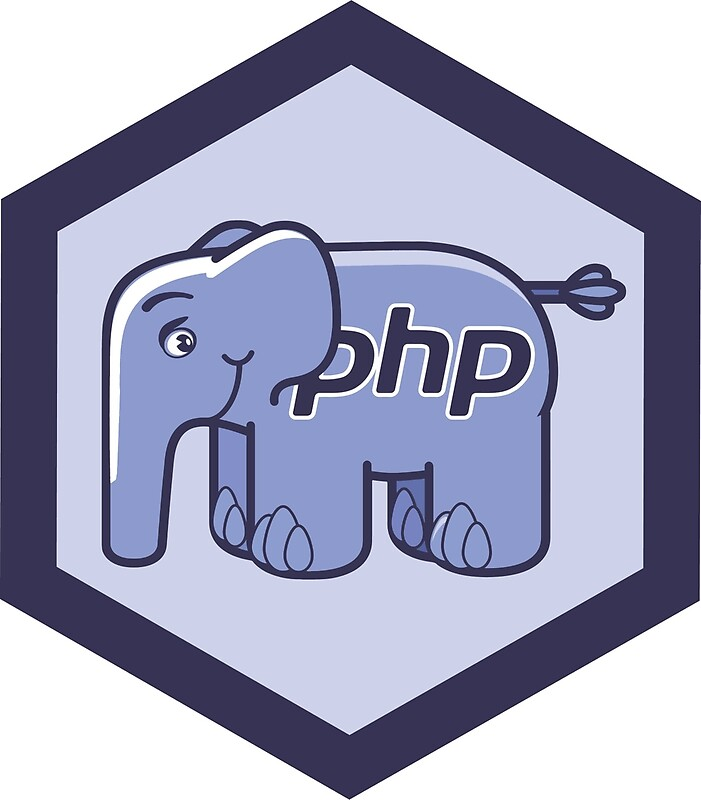

  

# API Project 

An API application that lets the user create posts, categories, and the relation between posts categories. The Application uses the full OOP paradigms. The Application is having routes to create, read, update, and delete posts and Categories

## The design patterns used in this project are:

- Fluent Interface:
  is used to define class methods/properties in a way that they are easy to read/follow just like a plain sentence in natural language.
- Dependency Injection:
  is a software design approach that allows avoiding hard-coding dependencies and makes it possible to change the dependencies both at runtime and compile time.
- Model-View-Controller (MVC):
 Is a software architectural pattern commonly used for developing user interfaces that divide the related program logic into three interconnected elements. This is done to separate internal representations of information from the ways information is presented to and accepted from the user.
- Repository:
  A repository represents an architectural layer that handles communication between the application and data source. It is a widely used pattern whose main point is that the application does not have to know which data source is implemented and how it is implemented.

## Getting started
App Routes

### JWT:

- [POST] /jwt

### Home:

- [GET] /

### OpenApi:

- [GET] /apidocs

### Posts:

- [POST] /posts/create
- [GET] /posts/listAll
- [GET] /posts/{id}
- [GET] /posts/listAllBySlug/{slug}
- [PUT] /post/update/{id}
- [DELETE] /post/delete/{id}

### Categories:

- [POST] /categories/create
- [GET] /categories/listAllCategories
- [GET] /categories/{id}
- [PUT] /categories/update/{id}
- [DELETE] /categories/delete/{id}

## Instructions for installation:

- Clone repository: `https://github.com/Giorgio163/api-php.git`
- Create the DB: `php vendor/bin/doctrine orm:schema-tool:create`
- Install the composer dependencies: `composer install`
- Configure the environment: `cp .env.example .env`
- Add your configuration to the `.env` file
- Run the application in your preferred localhost: `php -S localhost:???? -t public/`
- Run a test using PHPStan to see the code quality: `vendor/bin/phpstan analyse src`
- Run a test using PHP Code Sniffer: `./vendor/bin/phpcs --standard=PSR12 src/`
- php vendor/bin/phpunit test/ --colors

## Required:

- Slim Framework: `composer require slim/slim:"4.*"`,
-  `composer require slim/psr7`,
-  `composer require nyholm/psr7 nyholm/psr7-server`,
-  `composer require guzzlehttp/psr7 "^2"`,
-  `composer require laminas/laminas-diactoros`,
-  `composer require php-di/slim-bridge`
- Ramsey Uuid: `composer require ramsey/uuid`
- Ramsey Uuid/Doctrine: `composer require ramsey/uuid-doctrine`
- Monolog: `composer require monolog/monolog`
- JWT: `composer require firebase/php-jwt`
- Dotenv: `composer require vlucas/phpdotenv`
- Swagger: `composer require zircote/swagger-php`
- Slugify: `composer require cocur/slugify`
- composer require monolog/monolog
- PHP Unit: `composer require --dev phpunit/phpunit ^9`
- Doctrine ORM: `composer require doctrine/orm`
- Doctrine Annotations: `composer require doctrine/annotations`
- Symfony Cache: `composer require symfony/cache`

### Remember to install PHPSTAN and codesniffer during the installation process in dev, if unable run the following:

- PHP Stan: `composer require --dev phpstan/phpstan`
- PHP Code Sniffer: `composer require squizlabs/php_codesniffer`

#### Use the following link for the images:

- `https://www.base64encoder.io/image-to-base64-converter/`